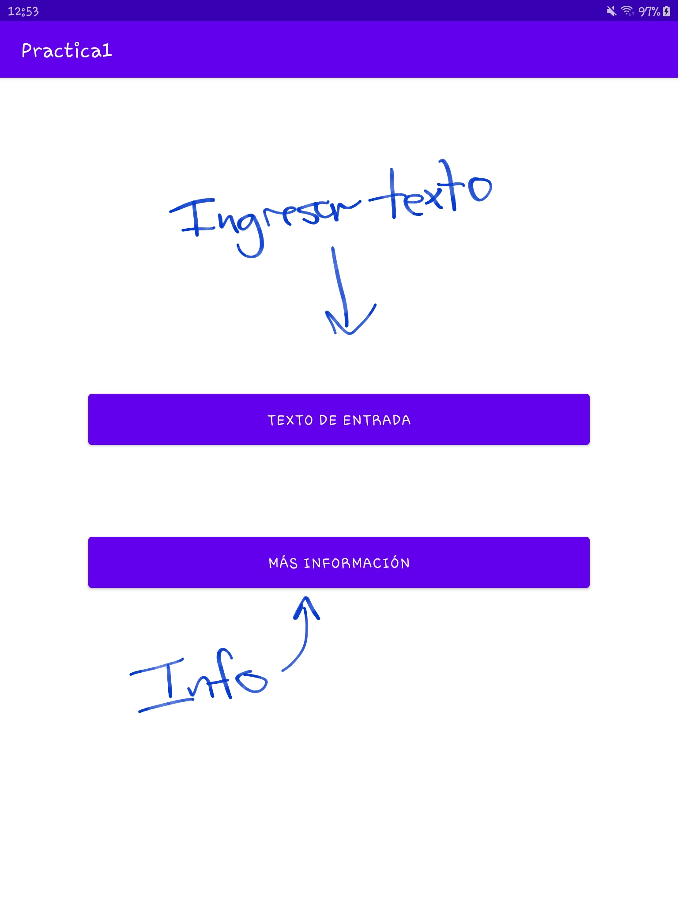
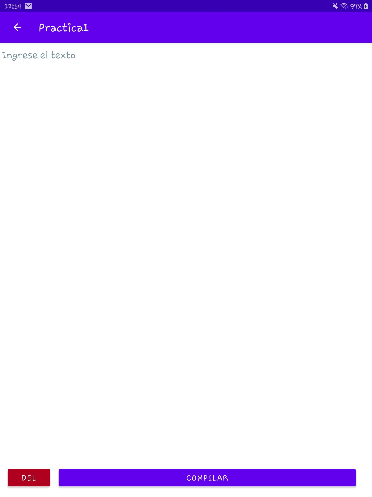
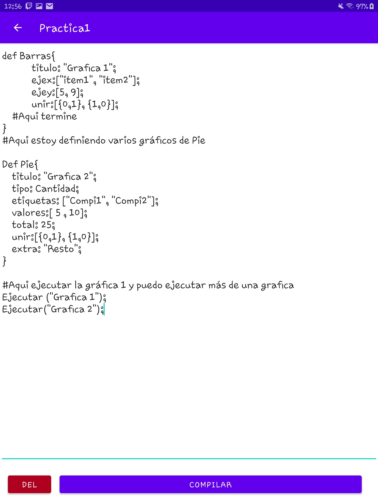
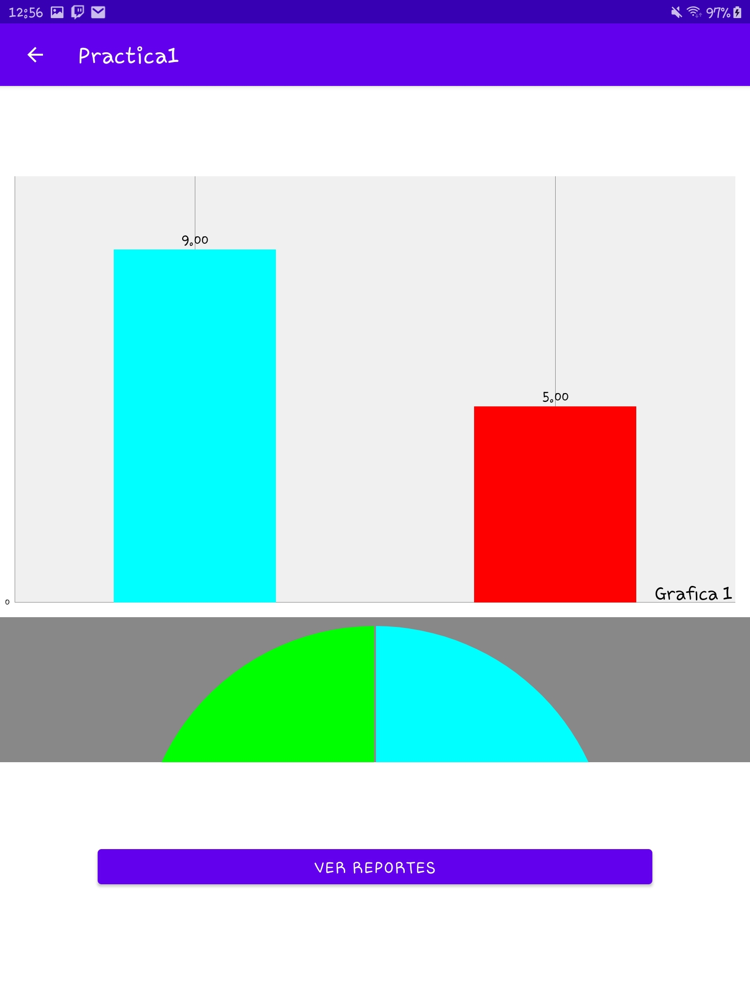
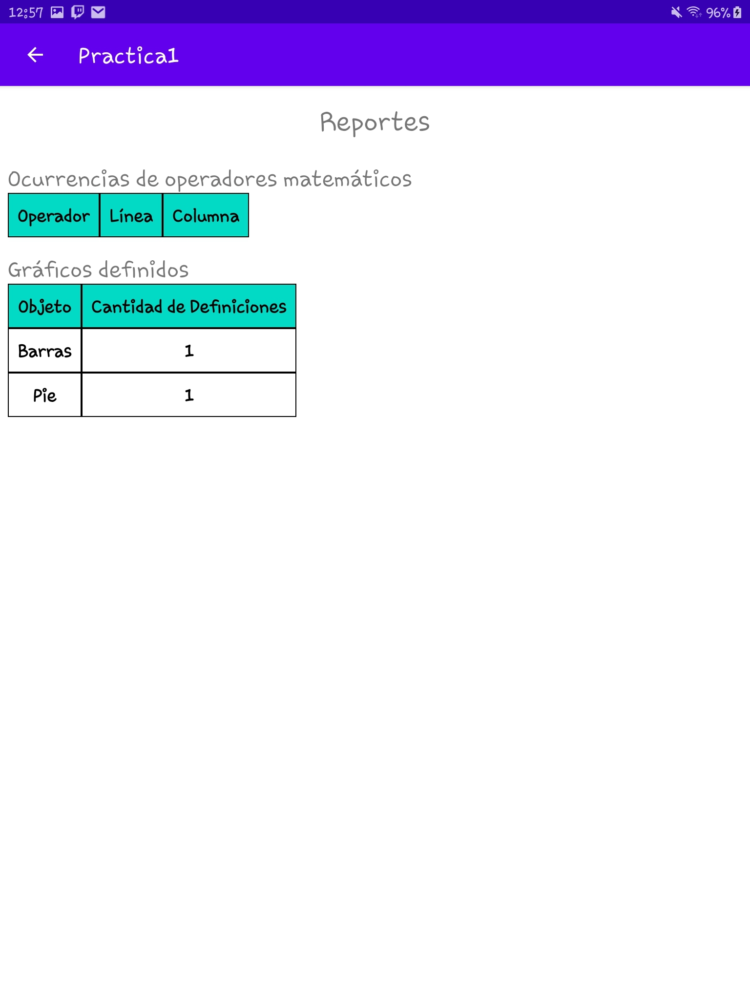
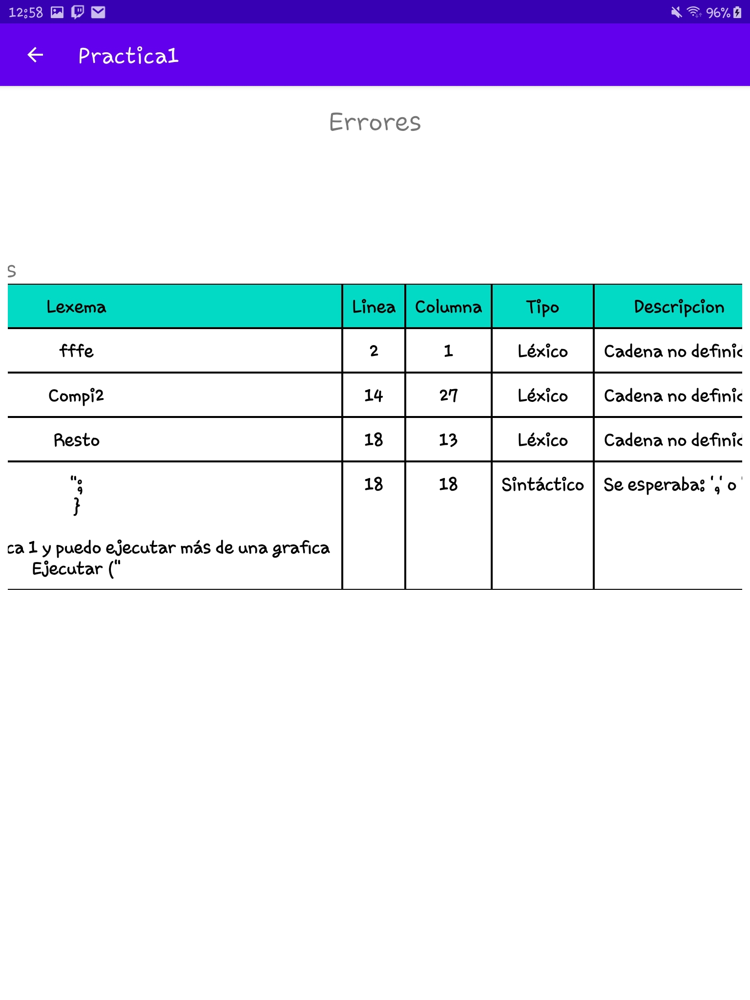

# Manual de usuario

# Breve descripción

Esta aplicación, escrita en su mayoría usando `Java` y para ciertas tareas usando `Kotlin`, permite crear gráficas de Barras y de Pastel usando un lenguaje específico. 

# Uso del lenguaje

[Untitled](https://www.notion.so/cbe572b3aaf54104af3cc71174b1c24b)

# Uso de la aplicación

## Pantalla de inicio

Esta pantalla cuenta con dos botones, el primero brinda más información acerca de la aplicación y el desarrollador. El segundo es ingresar texto sobre las gráficas.

## Ingreso de texto

En espa pantalla se muestra un espacio en el cual se puede escribir texto, basado en el lenguaje de las gráficas. Cuenta con un botón de compilar que, si no encuentra algún error, muestra las gráficas y el botón `DEL` para borrar el texto ingresado.

## Gráficas

Si el texto está correcto se mostrarán las gráficas. También se cuenta con un botón para ver el reporte de las gráficas.

## Reportes de gráficas

## Reporte de errores

Si el texto ingresado no está correcto se mostrarán los errores para corregirlo

